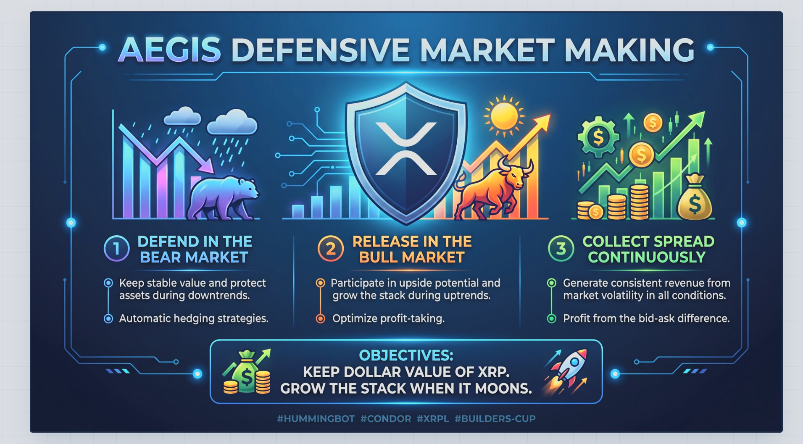

# AEGIS — Defensive Market Making



A defensive dual-book market maker on the XRP Ledger. It quotes **XRP-RLUSD** and **XRP-USDC**. Fills become one XRP pile. While that pile is heavy, a **1× Gate XRP-USDT perpetual short** is a shield — not a bet that XRP goes down. A dump must not hollow out the dollars. A real moon (+6% from hedge entry) cuts the short only; the coins stay. If price snaps back inside +3%, the shield goes back on. Both books stay on. One Hummingbot bot (`aegis-aegis_operator`) runs both `pmm_simple` controllers; the shield is a `position_executor`.

## What it is

- **Strategy type:** Agent — AI/autonomous trading agent (LLM loop + Hummingbot executors)
- **Ledger:** XRPL dual-book maker on XRP-RLUSD and XRP-USDC, with a Gate perp inventory shield
- **Tick:** six deterministic clerks run every 600s — init, health, heal, quote planner (×2), inventory, shield
- **Shield:** 1× Gate XRP-USDT short, cap $280, pump cut +6%, re-arm inside +3%, never a directional bet
- **Envelope:** $800 one bankroll — XRPL $500 (quotes + pile + reserves), Gate USDT $300 (1× short margin)
- **No hunt:** both books stay on; drawdown scales quotes, does not flatten the hedge while you hold XRP

## Run

```bash
./.venv/bin/python agents/aegis/tests/test_aegis_pure.py
./.venv/bin/python agents/aegis/tests/validate_agent.py
```

Drop `agents/aegis/` into a Condor checkout. Not a Hummingbot/Condor fork.

- Deck: `aegis-deck.html`
- Admin draft: `aegis-admin-draft.md`
- Script: `aegis-script.md`

Private working copy. Do not push to hummingbot/condor from the live box.
